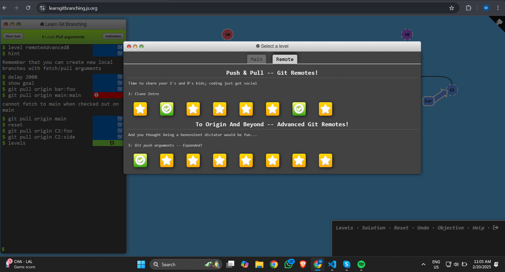

# What I Have Learned About Git From (https://learngitbranching.js.org/)

## Basic Git Commands
### Git Commit
- The `git commit -m` command is used to save changes to the local repository, capturing a snapshot of modified files in a branch.

```bash
git commit -m "Commit message"
```

### Git Branching and Checkout
- I learned how to create and switch branches using `git branch` and `git checkout`.
- The `git checkout -b branch_name` command allows me to create and switch to a new branch in one step.
- Using `git branch feature-xyz`, I can create a new branch, and `git checkout feature-xyz` allows me to switch to it.

```bash
git branch feature-xyz
git checkout feature-xyz
```

### Moving Between Commits
- The `git checkout HEAD^` command allows you to move one commit back in history, effectively checking out the previous commit.

```bash
git checkout HEAD^
```

- The `git branch -f branch HEAD~1` command moves a branch reference back by one commit, discarding the latest commit from the branch reference.

```bash
git branch -f feature-xyz HEAD~1
```

## Intermediate Git Commands

### Git Merge
- The `git merge feature-xyz` command integrates changes from `feature-xyz` into the current branch, adding a new commit that connects both histories.
- Merging helps combine development work from different branches into a unified branch.

```bash
git merge feature-xyz
```

### Git Revert and Reset
- The `git revert HEAD` command creates a new commit that undoes the changes of a previous commit while preserving history.

```bash
git revert HEAD
```

- The `git reset HEAD~1` command moves the branch pointer backward, effectively removing the latest commit from history.

```bash
git reset HEAD~1
```

## Advanced Git Commands

### Git Cherry-Pick
- The `git cherry-pick <commit-hash>` command allows me to apply specific commits from another branch onto my current branch without merging the entire branch.

```bash
git cherry-pick <commit-hash>
```

### Git Rebase
- The `git rebase` command helps me keep my commit history clean by moving commits onto another branch.
- I can interactively rebase commits using `git rebase -i HEAD~4` to edit, reorder, or remove commits.
- `git rebase main` allows me to update my branch with the latest changes from `main`.
- The `git rebase branch1 branch2` command rebases `branch1` onto `branch2`, applying commits from `branch1` on top of `branch2`.

```bash
git rebase main
git rebase -i HEAD~4
```

### Git Tags
- Tags help mark significant points in commit history, such as software releases.
- I learned to create lightweight and annotated tags using `git tag v1.0` and `git tag -a v1.0 -m "Version 1.0 release"`.
- I can push tags to remote using `git push origin v1.0` and delete them if necessary.

```bash
git tag v1.0
git tag -a v1.0 -m "Version 1.0 release"
git push origin v1.0
```

### Creating a Branch from an Ancestor Commit
- Using `git branch branchname main^^2^`, I can create a new branch from an ancestor commit of `main` instead of the latest commit.
- This is helpful when I want to work from an earlier point in the commit history.

```bash
git branch branchname main^^2^
```

These Git commands and techniques help me manage branches, commits, and history efficiently in my projects.
### Task Ranking Screenshot

---
