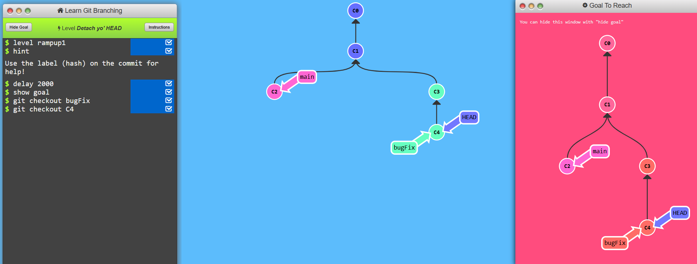
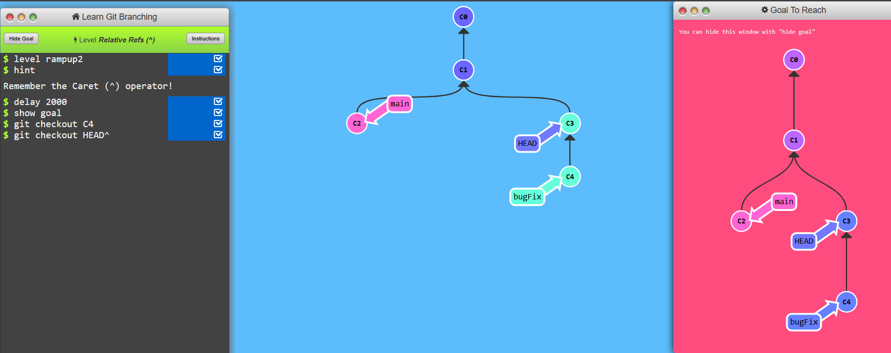
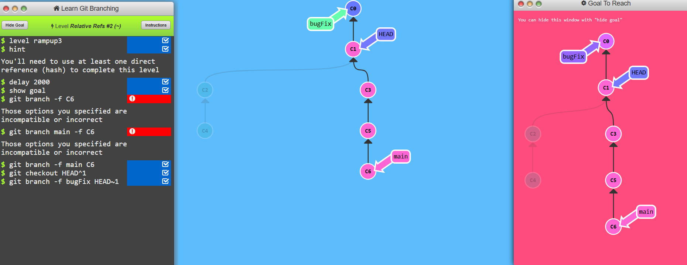
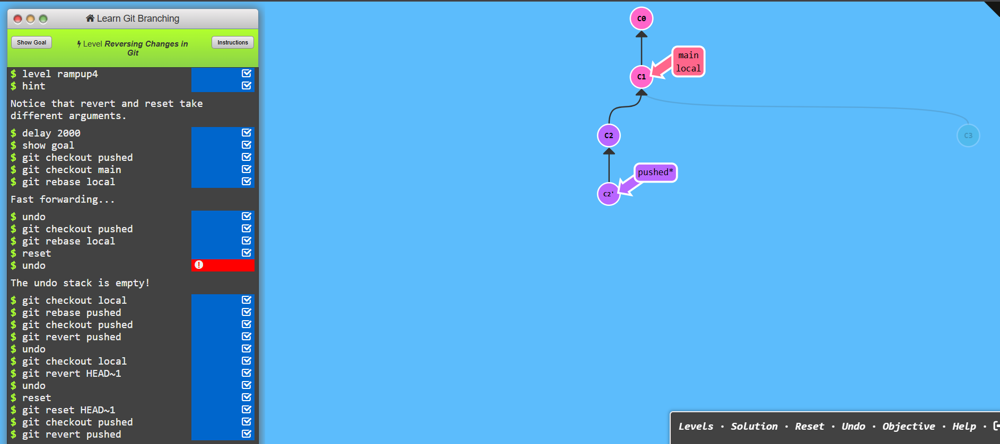

### LEVEL 2.1
* git checkout- Moving Between Nodes (Branches) in the Graph
```bash
git checkout feature-xyz
```


---
### LEVEL 2.2
* git checkout HEAD^ - The HEAD^ notation allows you to move one commit back in history, effectively "checking out" the previous commit.


```bash
git checkout HEAD^

```


---
### LEVEL 2.3
* git branch -f branch HEAD~1 -This makes feature-xyz point to the commit just before its current HEAD, discarding the latest commit from the branch reference.

```bash
git branch -f feature-xyz HEAD~1
```

---
### LEVEL 2.4
* git revert creates a new commit that undoes the changes of a previous commit while preserving history.

```bash
git revert HEAD
```
* git reset HEAD~1 - Moving the Branch Pointer Backward
git reset moves the branch pointer to an earlier commit, removing commits from history.

```bash
git reset HEAD~1
```
