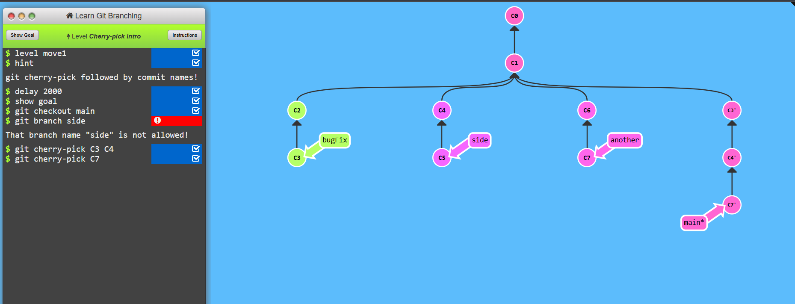
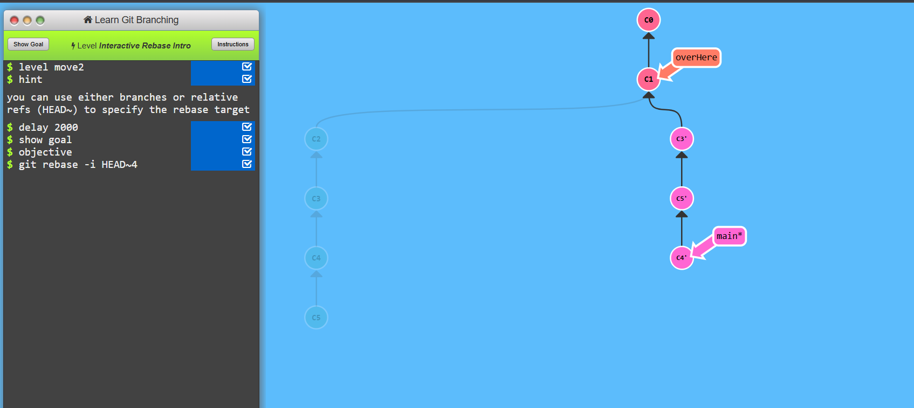

### LEVEL 3.1
* git cherry-pick allows you to apply a specific commit from one branch to another without merging the entire branch.
```bash
git cherry-pick <commit-hash>
```


---


### LEVEL 3.2
* git rebase -i HEAD~4 - Interactive Rebase for the Last 4 Commits
This command allows you to rewrite the last 4 commits interactively, giving options to edit, squash, reorder, or remove commits.

```bash
git rebase -i HEAD~4
```


---