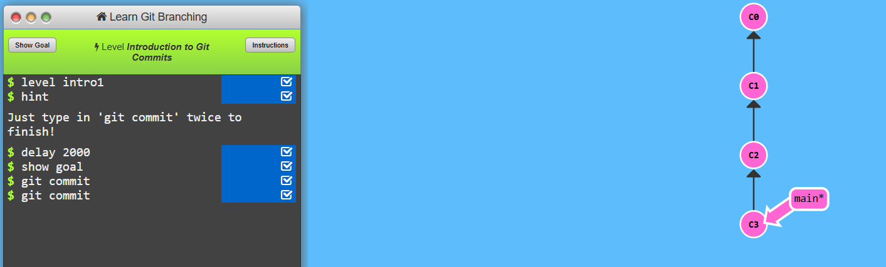
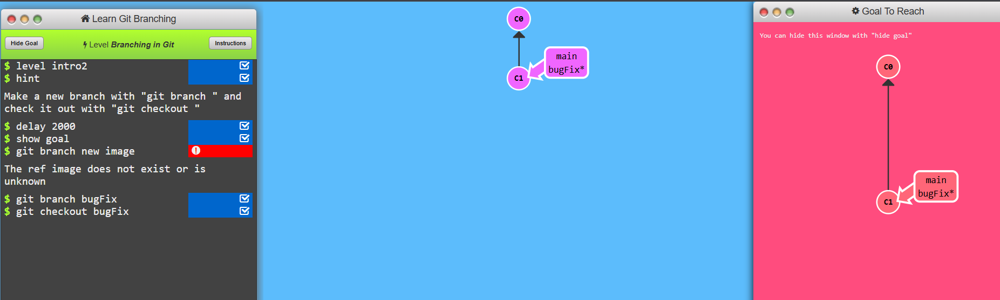
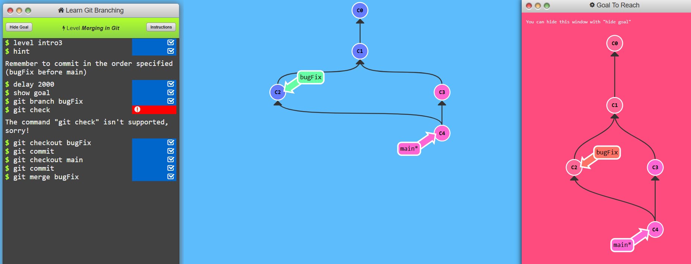
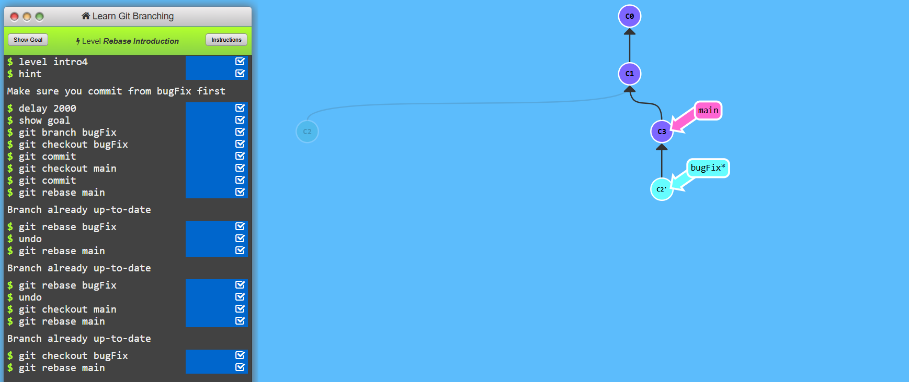

### LEVEL 1.1
* The git commit command is used to save changes to the local repository. It captures a snapshot of the modified files in a branch.

```bash 
git commit -m 
```

---
## LEVEL 1.2
* This adds a new "node" (branch) in the repository's commit graph, representing a parallel line of development.
```bash
git branch feature-xyz
```

* git checkout- Moving Between Nodes (Branches) in the Graph
```bash
git checkout feature-xyz
```

---

### LEVEL 1.3
* git merge - Combining Nodes (Branches) in the Visual Graph
```bash
git merge feature-xyz
```
* This integrates changes from feature-xyz into the current branch, adding a new commit that connects both histories.



---

### LEVEL 1.4
* git rebase - Rebasing moves a branch's commits to a new base, creating a cleaner history.

```bash
git checkout feature-xyz  
git rebase main  
```
