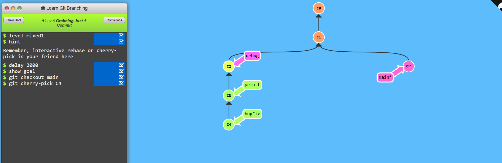
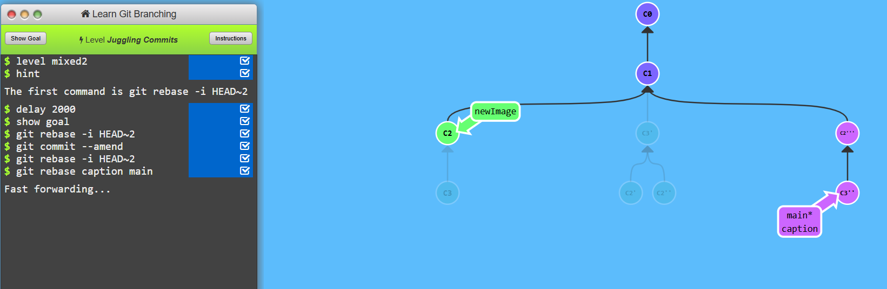
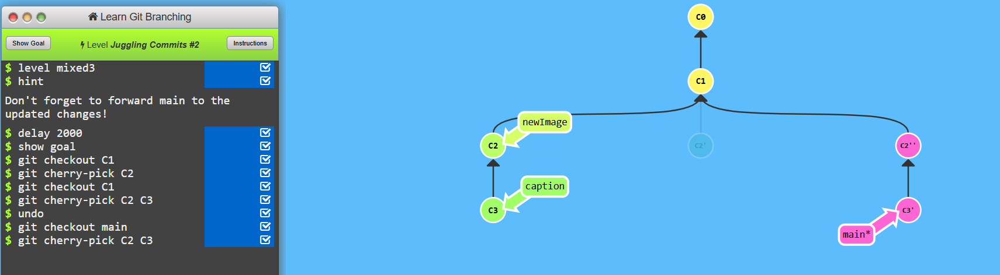
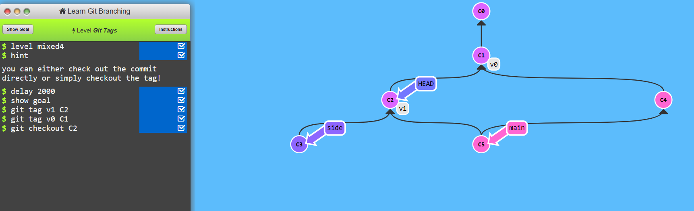
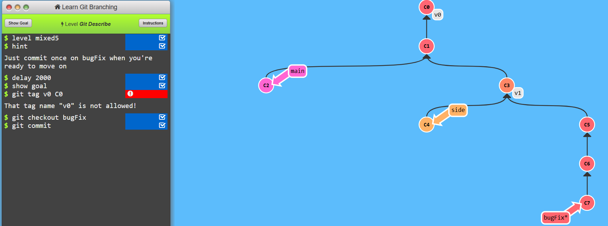

### level 4.1
* Switch to an existing branch
 ```bash
git checkout branch_name
```
* Create a new branch and switch to it
```bash
git checkout -b new_branch
```

* The git checkout command is used to switch branches or restore files.
* The git cherry-pick command applies a specific commit from another branch onto the current branch.

```bash
# Apply a single commit
git cherry-pick <commit-hash>

# Apply multiple commits
git cherry-pick <commit1> <commit2> <commit3>
```


---

### level 4.2
* git commit --amend : The git commit --amend command allows you to modify the most recent commit.
```bash
# Modify the last commit message
git commit --amend -m "New commit message"

# Add changes to the last commit
git commit --amend --no-edit
```
* git rebase: The git rebase command is used to modify commit history by rearranging, editing, or combining commits.
```bash
# Interactive rebase for the last 2 commits
git rebase -i HEAD^2

# Rebase a feature branch onto main
git rebase main
```

---
### level 4.3
* The git cherry-pick command applies a specific commit from another branch onto the current branch.

```bash
# Apply a single commit
git cherry-pick <commit-hash>

# Apply multiple commits
git cherry-pick <commit1> <commit2> <commit3>
```
* Switch to an existing branch
 ```bash
git checkout branch_name
```

---
### level 4.4
* git tag

The git tag command is used to create and manage tags, which mark specific points in commit history (e.g., version releases).

```bash
# List all tags
git tag

# Create a new lightweight tag
git tag v1.0

# Create an annotated tag
git tag -a v1.0 -m "Version 1.0 release"

# Push a tag to remote
git push origin v1.0

# Delete a local tag
git tag -d v1.0

# Delete a remote tag
git push --delete origin v1.0
```

---
### level 4.5
* Switch to an existing branch
 ```bash
git checkout branch_name
```
* Create a new branch and switch to it
```bash
git checkout -b new_branch
```

* The git checkout command is used to switch branches or restore files.
* The git cherry-pick command applies a specific commit from another branch onto the current branch.

```bash
# Apply a single commit
git cherry-pick <commit-hash>

# Apply multiple commits
git cherry-pick <commit1> <commit2> <commit3>
```

---