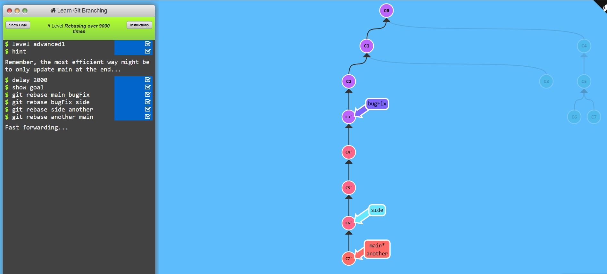
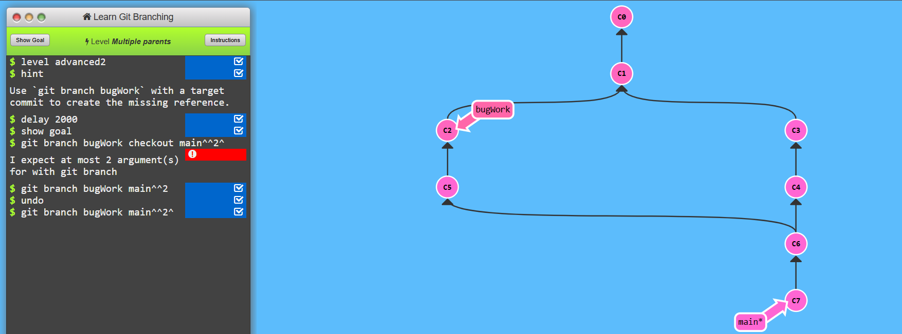
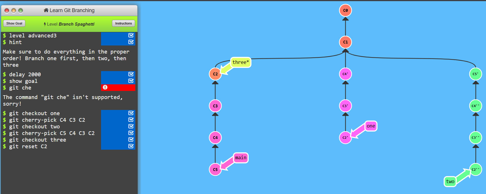

### level 5.1
* git rebase branch1 branch2: This command rebases branch1 onto branch2, applying the commits from branch1 on top of branch2.
```bash
git rebase main branch2
```

---

### level 5.2
* git branch branchname main^^2^ : The git branch branchname main^^2^ command creates a new branch starting from an ancestor commit of main.

```bash
# Create a new branch from the grandparent of main
git branch new_branch main^^2^
```

---
### level 5.3
* Switch to an existing branch
 ```bash
git checkout branch_name
```
* Create a new branch and switch to it
```bash
git checkout -b new_branch
```

* The git checkout command is used to switch branches or restore files.
* The git cherry-pick command applies a specific commit from another branch onto the current branch.

```bash
# Apply a single commit
git cherry-pick <commit-hash>

# Apply multiple commits
git cherry-pick <commit1> <commit2> <commit3>
```



---


