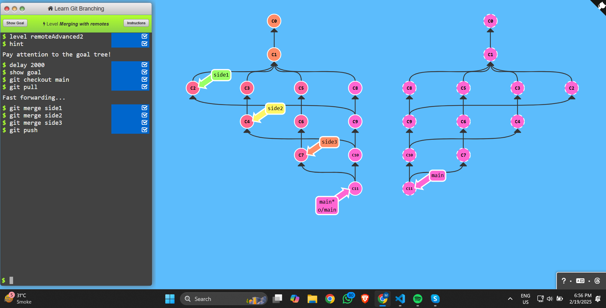
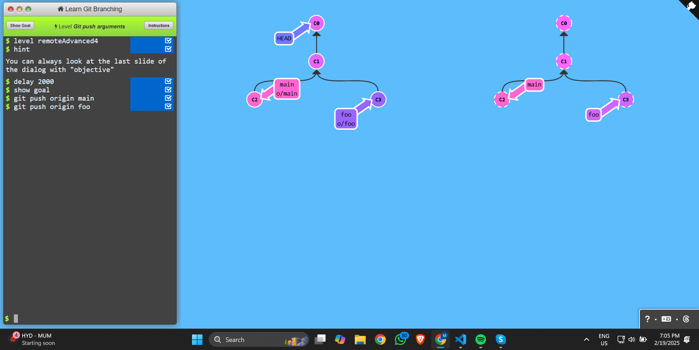
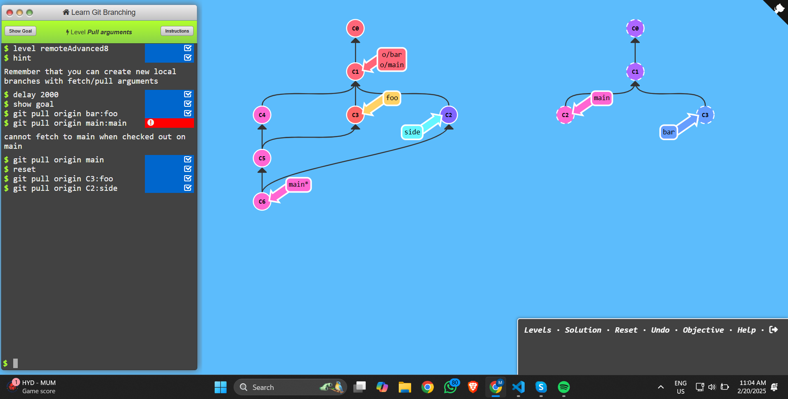

### level 1:
# Git Commands Explained


```sh
# Fetch latest changes from remote
git fetch
# Switch to another branch
git checkout
# Rebase changes onto another branch
git rebase
# Force move main branch to side3
git branch -f main side3

```

---
### level 2:
# Git Commands Explained


```sh
### Push local changes to remote
git push
# Merge another branch into the current branch
git merge <branch-name>

```

---
### level 3:

```bash
# latest changes with rebase
git pull --rebase
```
* Fetches the latest changes from the remote repository.

---
### level 4:
#### Git Command: `git push origin main`

#### 1. Push local changes to remote
```sh
git push origin main
```

### level 5:
* git push origin → Push something to the remote repository named origin.
* main^ → Refers to the parent commit of main (the commit before the latest one).
* foo → The name of the new branch (or ref) on the remote.
```sh
git push origin main^:foo
```

---
### level 6:
* git fetch origin → Fetches data (commits, branches) from the remote named origin.
* C3 → A specific commit or reference from the remote repository.
* main → The local branch that should be updated with C3.
* C3:main → Means "fetch commit C3 from origin and update (or create) the local main branch to point to C3."
```sh 
git fetch origin C3:main
```

---
### level 7:
```sh
git fetch origin main:foo

```


---
### level 8:
```sh
git pull origin C3:foo
```
* This downloads commit C3 and creates (or updates) a local branch foo pointing to C3


---