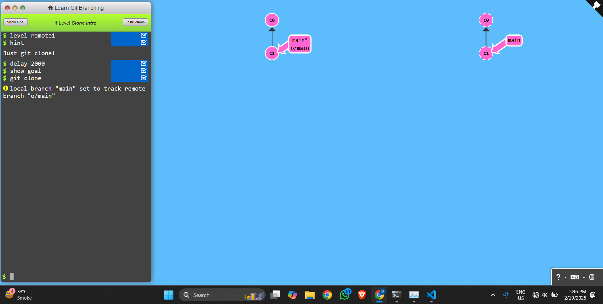
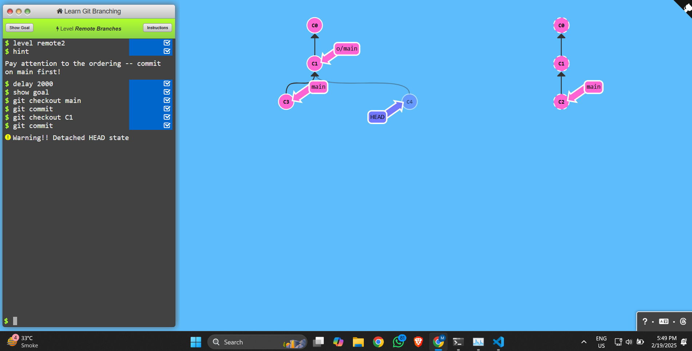
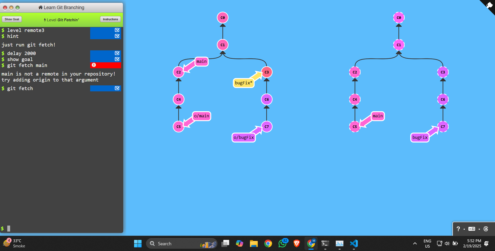
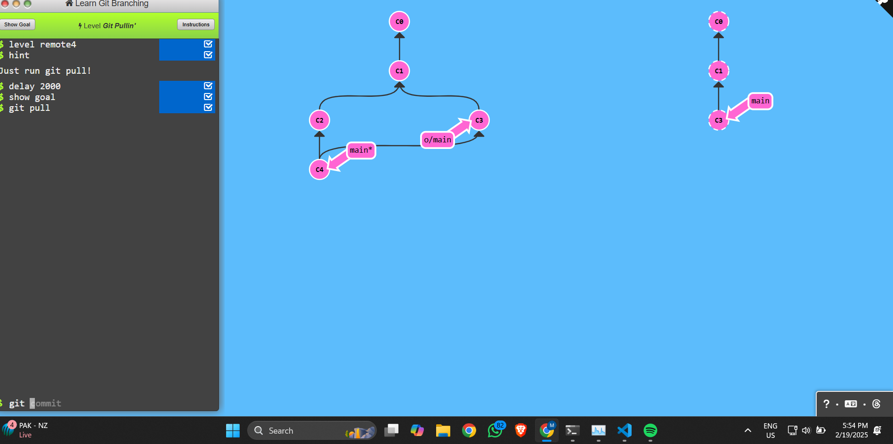
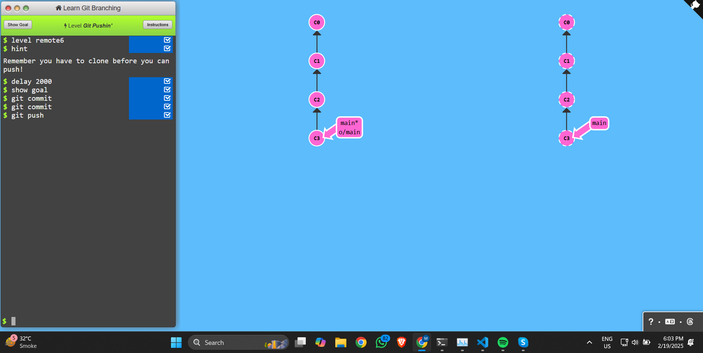
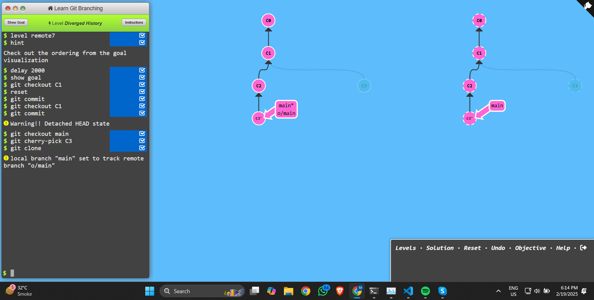
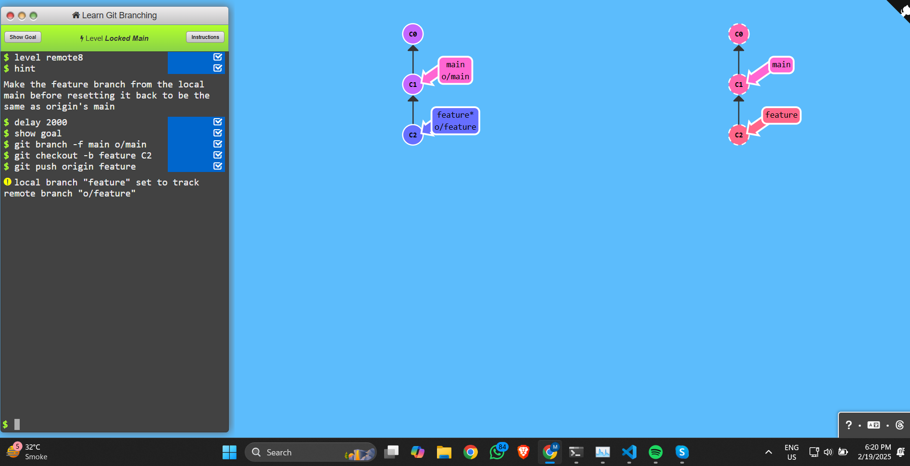

### level 1:
```sh
git clone <repository_url>
```
* Copies a remote Git repository to your local machine.


### level 2:
```sh
# Switch to an existing branch:
git checkout <branch-name>
# Saves changes to the local repository.
git commit -m "Your commit message"
```

### level 3:
* Downloads (fetches) new commits, branches, and tags from the remote repository.
```sh 
git fetch main
```

### level 4:
```sh
git pull
```

### level 5:
```sh 
git branch bugFix
git checkout bugFix
```

### level 6:
```sh
git commit 
git commit 
git push
```

### level 7:
```sh
git cherry-pick C3
git checkout C1
git clone
```

### level 8:
```sh
git branch -f main o/main
git checkout -b fearture C2
git push origin feature
```
